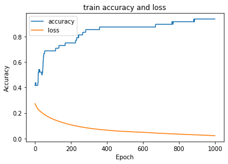

# RBF_neural_network_python
Author: Abderraouf Zoghbi , UBMA , Departement of Computer Science.

This is an implementation of a Radial Basis Function class and using it as a layer in a simple Neural Network for classification the origin of olive oil (olive.csv) in Python.

Feel free to use or modify the code.

## Requirements:
+ [Keras](https://keras.io)
+ [Tensorflow](https://www.tensorflow.org)
+ [Tensorflow](https://scikit-learn.org/stable/index.html)
+ optionally Matplotlib
## Usage
After processing data you can build the model by adding the RBF hidden layer using RBF class in your network.
```
model = Sequential()
rbflayer = RBFLayer(34,
                        initializer=InitCentersKMeans(X_train),
                        betas=3.0,
                        input_shape=(568,))
model.add(rbflayer)
model.add(Dense(4))
model.add(Activation('linear'))
model.compile(loss='mean_squared_error',
                  optimizer=RMSprop(), metrics=['accuracy'])
print(model.summary())
history1 = model.fit(X_train, y_train, epochs=1000, batch_size=32)

```
## Results


In the training phase the model can predict up to 95%
pass rate and with 0.0155 error.
## License
[MIT](http://opensource.org/licenses/mit-license.php) License.


