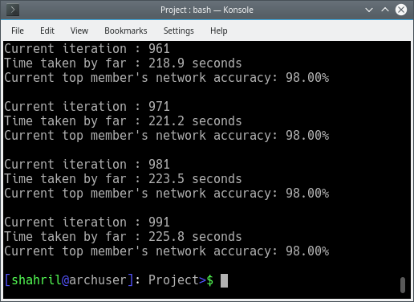

# Neural Network with Genetic Algorithm Optimizer

For training a neural-network, we have an awesome *back-propagation algorithm* that allows us automatically tweak our weights and biases to fit our dataset. This is just a project came out of curiosity -- to test for another method that is possible to tweak the network without depending on any model-based algorithm.

To be honest, back-propagation is still the winning choice here. This is just a proof-of-concept project, which has proved that randomness of genetic algorithm is still possible to let the network learn, albeit *very very slow learning*.

Please be noted, for large dimension of data (eq: mnist/cifar-10), back-progapation wins the competition by tenfolds. That is why for this project I chose to use Iris dataset, as it is small enough for me to conduct an experiment.

## How to run?

1) Install dependencies

`pip install -U scikit-learn numpy pandas`

2) Run the project

`python neural-net-ga.py`

## Screenshot

